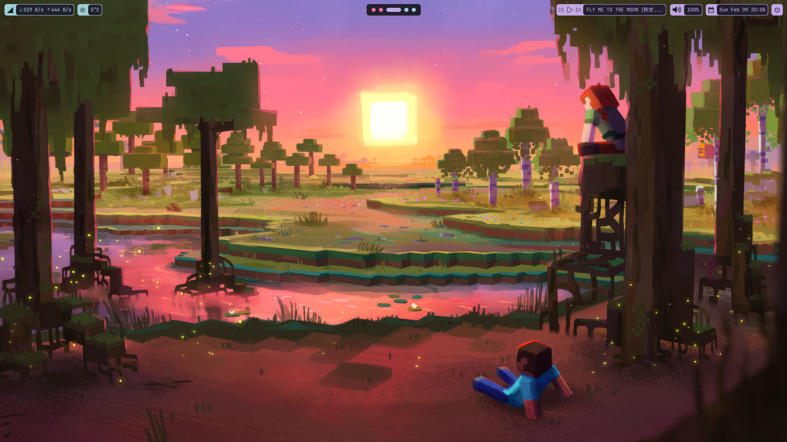
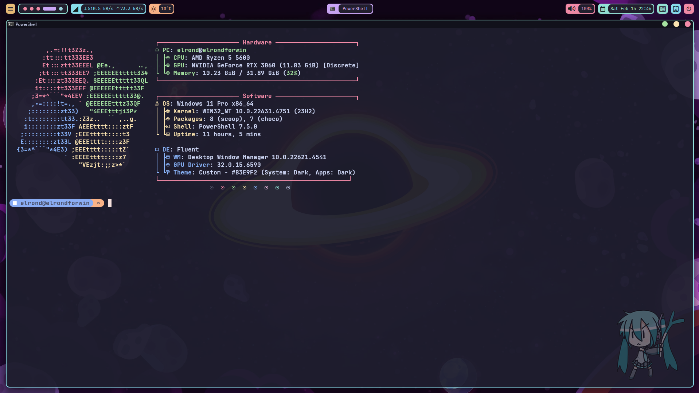

# 
Hyprland Inspired Windows Catppuccin Rice

### 
my current desktop dotfiles :p

### Quick Showcase Video
https://www.youtube.com/watch?v=weYnACBLg1w

# Used
- **Topbar:** [yasb](https://github.com/amnweb/yasb) with my [config](configs/yasb/)
- **WM:** [komorebi](https://github.com/LGUG2Z/komorebi) with my [config](configs/komorebi.json)
- **Window Borders:** [tacky-borders](https://github.com/lukeyou05/tacky-borders) with my [config](configs/tacky-borders/config.yaml)
- **Theme:** [Niivu's Catppuccin](https://www.deviantart.com/niivu/art/Catppuccin-for-Windows-11-1076249390) (patched with [SecureUXTheme](https://github.com/namazso/SecureUxTheme))
- **Wallpaper:** [Minecraft Sunset 4K](https://steamcommunity.com/sharedfiles/filedetails/?id=3270848940) (requires [Wallpaper Engine](https://store.steampowered.com/app/431960/Wallpaper_Engine/))
- **Hatsune Miku in the explorer:** [explorertool](https://github.com/Maplespe/explorerTool)
- **Taskbar:** [StartAllBack](https://www.startallback.com/) with my [settings](settings/startallback)
- **Spotify:** Spiced up with [spicetify](https://spicetify.app/), applied a theme named [text](https://imgur.com/a/OysmIjthttps://imgur.com/a/OysmIjt) and selected CatppuccinMauve option in the marketplace tab

## **Other Tweaks and Notes**
- **Spotlight-Like Search:** [flow launcher](https://www.flowlauncher.com/)
- **New Tab Page in Zen:** [mtab](https://github.com/maxhu08/mtab) (I only use wallpaper setting, other settings are all off) ([wallpaper](https://raw.githubusercontent.com/orangci/walls/main/retro2_live.gif))
- **PowerShell Customization:** [Oh My Posh](https://ohmyposh.dev/) with my config which is based on [catppuccin oh-my-posh theme](https://github.com/JanDeDobbeleer/oh-my-posh/blob/main/themes/catppuccin.omp.json)
- **Other Apps Themes:** They are all on [Catppuccin Ports](https://catppuccin.com/ports)
* I generally used things in the [niivu's theme installation guide, extra info section](https://www.deviantart.com/niivu/art/How-to-install-Windows-10-or-11-Themes-708835586) like [OldNewExplorer](https://msfn.org/board/topic/170375-oldnewexplorer-119/)
* Applied some settings in the theme folder which you can access with downloading the [theme](https://www.deviantart.com/niivu/art/Catppuccin-for-Windows-11-1076249390).
* I don't use custom icons, if you know good icon packs that can fit these rice, please let me know.